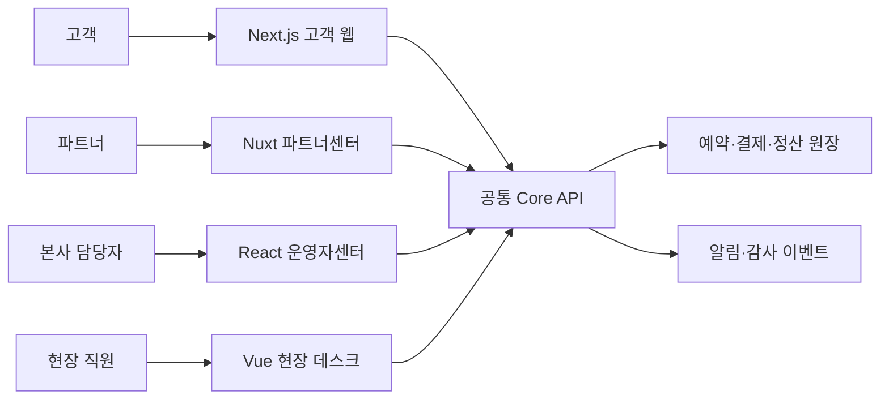

# DayLink 통합 PRD 개요

- 문서 버전: 1.0
- 작성일: 2026-08-18
- 상태: 학습용 구현 기준선
- 서비스 성격: 실제 운영을 가정한 가상 로컬 클래스·체험 예약 플랫폼

## 1. 문서 목적

React, Next.js, Vue, Nuxt의 주요 실무 기능을 각각 독립된 제품에서 학습한다. 단순 예제 네 개가 아니라 하나의 예약 서비스 안에서 데이터와 업무가 이어지는 네 사이트를 만든다.

`모든 기능`을 문자 그대로 소진하는 것은 범위가 무한하고 폐기·실험 API까지 포함되어 학습 효율이 낮다. 본 기획의 필수 범위는 다음으로 한정한다.

- 각 기술의 안정판에서 실무 사용 빈도가 높은 핵심 기능
- 렌더링, 라우팅, 상태, 폼, 비동기 처리, 오류 처리, 권한, 성능, 접근성, 테스트
- 실제 서비스에서 발생하는 동시성, 재시도, 권한 오용, 결제 불일치, 오프라인 충돌
- 드물거나 실험적인 기능은 본 제품을 훼손하지 않는 별도 확장 과제로 분리

버전은 구현을 시작하는 날의 최신 안정판으로 고정하고 ADR에 기록한다. 구현 도중 자동으로 메이저 버전을 올리지 않는다.

## 2. 서비스 정의

### 2.1 한 줄 정의

고객이 지역 클래스와 체험을 찾고 예약하며, 파트너가 상품과 일정을 운영하고, 본사 담당자가 심사·환불·정산을 관리하며, 현장 직원이 방문자를 체크인하는 서비스다.

### 2.2 가상 운영 조건

- 서비스 지역: 대한민국
- 통화: KRW만 지원
- 표시 시간대: Asia/Seoul, 저장 시간: UTC
- 결제: 테스트 결제수단만 사용
- 수익 모델: 예약금액의 12% 중개 수수료를 계산하되 실제 과금·지급은 하지 않음
- 주문 제약: 주문 하나에는 체험 회차 하나만 담을 수 있음
- 예약 인원: 주문당 1~6명
- 취소 단위: MVP에서는 예약 전체 취소만 지원하며 일부 인원 취소는 운영자 예외 처리
- 재고 선점: 결제 시작 시 10분
- 알림 채널: 앱 내 알림과 이메일 모의 발송. 문자·푸시는 확장 범위

## 3. 사이트 구성

| 번호 | 사이트 | 기술 | 주 사용자 | 제품 역할 |
|---|---|---|---|---|
| 1 | DayLink 고객 웹 | Next.js + React | 고객·비회원 | 검색, 상세, 예약, 결제, 예약 관리, 후기 |
| 2 | DayLink 파트너센터 | Nuxt + Vue | 호스트·매니저·회계 담당 | 입점, 상품, 회차·재고, 예약, 정산, 팀 권한 |
| 3 | DayLink 운영자센터 | React SPA | 본사 운영·CS·정산·관리자 | 심사, 고객지원, 환불 승인, 정산 대사, 감사 |
| 4 | DayLink 현장 데스크 | Vue SPA/PWA | 현장 직원·슈퍼바이저 | QR 체크인, 참석자 관리, 오프라인 동기화, 사고 보고 |

각 사이트는 저장소와 배포 단위가 분리된 별도 제품이다. 로그인 세션과 장애 영향도 분리한다. 공통 UI 코드를 네 사이트가 직접 공유하지 않고 디자인 토큰과 API 스키마만 공유한다. 그래야 각 기술의 구성 방식을 실제로 경험할 수 있다.

## 4. 제품 경계와 데이터 소유권

프론트엔드 서버 기능은 화면에 맞춘 데이터 조합, 세션, 입력 검증, 오류 형식 통일, 캐시에 사용한다. 아래 업무 규칙은 반드시 공통 Core API가 단일 권위자가 된다.

- 남은 좌석 계산과 재고 선점
- 최종 가격·할인·환불액 계산
- 예약·결제·환불 상태 전이
- 정산 원장
- 권한의 최종 판정
- 중복 요청 방지와 감사 기록

초기 학습 단계에서는 Core API를 계약 기반 mock server로 대체할 수 있다. 다만 mock도 동일한 상태 전이와 오류 코드를 구현해야 한다.

## 5. 공통 사용자와 권한

| 주체 | 대표 권한 | 금지 사항 |
|---|---|---|
| 비회원 | 공개 검색·상세·도움말 | 예약 확정, 찜, 후기 |
| 고객 | 본인 예약·결제·취소·후기 | 타인 예약 열람, 운영 데이터 접근 |
| 파트너 소유자 | 자기 사업장 전체, 팀·정산 | 다른 파트너 데이터 접근 |
| 파트너 매니저 | 상품·회차·예약 관리 | 정산계좌·소유자 변경 |
| 콘텐츠 편집자 | 상품 초안 작성 | 게시 승인, 예약·정산 접근 |
| 회계 담당 | 정산 조회·내보내기 | 상품·예약 변경 |
| 현장 직원 | 지정 사업장의 당일 참석자·체크인 | 가격·환불·정산 변경 |
| 심사 담당 | 상품 승인·반려 | 고액 환불 최종 승인 |
| CS 담당 | 고객·예약 조회, 제한된 환불 요청 | 본인 요청 승인, 정산 수정 |
| 정산 담당 | 원장 대사·조정 요청 | 상품 심사, 고객 개인정보 일괄 반출 |
| 슈퍼관리자 | 역할 부여·긴급 조치 | 감사 기록 삭제 |

UI에서 메뉴를 숨기는 것은 편의 기능일 뿐이다. 모든 읽기·쓰기 권한은 Core API에서 다시 검사한다.

## 6. 공통 도메인 모델

| 엔터티 | 핵심 필드 |
|---|---|
| User | id, 이름, 연락처, 상태, 동의 버전 |
| Partner | id, 상호, 사업장, 입점 상태, 정산 정보 |
| Experience | id, partnerId, 제목, 설명, 장소, 정책, 게시 버전, 상태 |
| Session | id, experienceId, 시작·종료 시각, 정원, 판매 상태 |
| PricePlan | 정상가, 인원 구간, 유효 기간, 세금·수수료 기준 |
| Hold | id, sessionId, 인원, 가격 스냅샷, 만료 시각, 상태 |
| Booking | id, userId, sessionId, 인원, 예약 상태, 정책 스냅샷 |
| Payment | id, bookingId, 승인·취소 금액, 결제 상태, 외부 거래키 |
| Refund | id, bookingId, 요청·승인·지급 상태, 사유, 금액 |
| Attendance | bookingId, 참석 인원, 체크인 시각, 장치, 동기화 상태 |
| Review | bookingId, 평점, 내용, 공개 상태, 신고 상태 |
| SettlementEntry | partnerId, bookingId, 매출·수수료·환불·조정액 |
| AuditLog | actor, action, target, before/after, reason, traceId, time |

## 7. 공통 상태 모델

### 7.1 상품

`DRAFT → SUBMITTED → APPROVED → PUBLISHED → PAUSED → ARCHIVED`

- `SUBMITTED → REJECTED → DRAFT` 재작성 가능
- 승인된 핵심 정보가 변경되면 새 버전을 다시 심사
- 예약자가 있는 회차의 날짜·장소 변경은 일반 수정이 아니라 `RESCHEDULE` 절차 사용
- 확정 예약은 상품 게시 버전, 가격, 취소 정책, 회차 조건의 스냅샷을 보관하며 이후 공개본 수정으로 소급 변경되지 않음

### 7.2 예약

hold 상태: `ACTIVE → PAYMENT_PENDING → CONSUMED | EXPIRED | RELEASED`

예약 상태: `PAYMENT_PENDING → CONFIRMED → COMPLETED | NO_SHOW`

예외 상태:

- `PAYMENT_PENDING → PAYMENT_FAILED`
- `CONFIRMED → CANCEL_PENDING → CANCELLED`
- 체크인 인원이 1명 이상이면 회차 종료 후 `COMPLETED`, 0명이면 `NO_SHOW`

환불은 예약 상태에 섞지 않고 별도 엔터티로 `REQUESTED → APPROVAL_PENDING → PROCESSING → SUCCEEDED | PARTIALLY_SUCCEEDED | FAILED`를 사용한다. 예약이 취소되었어도 환불 재시도 상태는 따로 추적한다.

상태는 화면이 임의로 바꾸지 않는다. 요청은 명령으로 보내고 Core API가 상태 전이를 결정한다.

### 7.3 입점

`NOT_STARTED → PROFILE_PENDING → DOCUMENT_PENDING → REVIEWING → ACTIVE`

반려 시 `CHANGES_REQUIRED`, 운영 중 중대한 문제가 있으면 `SUSPENDED`다.

## 8. 공통 핵심 흐름

### 8.1 상품 게시부터 예약까지

1. 파트너가 프로필과 정산 정보를 등록한다.
2. 파트너가 상품 초안, 가격, 일정, 정원을 작성하고 심사를 요청한다.
3. 운영자가 승인하거나 수정 사유와 함께 반려한다.
4. 승인된 상품을 파트너가 게시한다.
5. 고객이 검색하고 회차·인원을 선택한다.
6. Core API가 현재 가격을 다시 계산하고 좌석을 10분간 선점한다.
7. 고객이 테스트 결제를 완료한다.
8. 결제 웹훅이 예약을 확정하고 알림 이벤트를 발행한다.
9. 현장 직원이 예약 QR을 확인하고 체크인한다.
10. 회차 종료 후 예약이 완료 처리되고 후기 작성과 정산 반영이 열린다.

### 8.2 취소·환불

1. 고객 또는 권한 있는 담당자가 취소 예상 환불액을 조회한다.
2. 고객이 환불 규정과 금액을 확인한 뒤 취소를 확정한다.
3. Core API가 취소·환불 명령을 멱등 처리한다.
4. 결제 결과와 별개로 예약 이력을 보존한다.
5. 정산 원장에는 기존 매출을 삭제하지 않고 반대 방향 조정 항목을 추가한다.

### 8.3 MVP 취소 정책 템플릿

법률 적합성을 주장하는 정책이 아니라 상태·경계 시각을 시험하기 위한 가상 규칙이다. 실제 출시 전 별도 법률 검토가 필요하다.

| 템플릿 | 고객 자발 취소 |
|---|---|
| FLEXIBLE | 시작 24시간 전까지 전액, 이후 시작 전까지 결제액의 50%, 시작 후 0원 |
| STANDARD | 시작 72시간 전까지 전액, 24~72시간 전 결제액의 50%, 24시간 미만·시작 후 0원 |

- 파트너 또는 플랫폼 귀책 회차 취소는 시각과 무관하게 고객 실결제액 전액을 환불한다.
- 경계 판단은 Core API의 서버 시각과 예약에 저장된 정책 버전을 사용한다.
- MVP 고객 화면은 예약 전체 취소만 지원한다.

### 8.4 MVP 금액·정산 규칙

- 상품 총액 `G = 인당 가격 × 예약 인원`
- 플랫폼 부담 쿠폰 `D`, 고객 실결제액 `C = G - D`
- 중개 수수료 `F = floor(G × 0.12)`
- 정상 완료 시 파트너 정산 예정액 `G - F`; 플랫폼 쿠폰은 파트너 정산액을 줄이지 않는다.
- 전액 취소 시 고객은 `C`를 돌려받고, 파트너 원장에는 기존 예정액을 상쇄하는 조정 항목을 추가한다.
- 예외 일부 환불은 운영자 승인과 귀책 주체가 필수이며 Core API가 고객 환불액과 파트너 조정액을 각각 계산한다.

## 9. 공통 API 원칙

- REST 또는 GraphQL 중 하나를 선택하되 네 앱이 같은 OpenAPI/GraphQL 스키마를 사용한다.
- 모든 변경 요청은 `Idempotency-Key`를 지원한다.
- 모든 응답은 `traceId`, 안정적인 `errorCode`, 사용자 메시지용 키를 포함한다.
- 금액은 정수 원 단위, 시간은 ISO 8601 UTC, 화면에서만 한국 시간으로 변환한다.
- 목록은 cursor pagination을 기본으로 하고 운영자 대형 표만 서버 정렬·필터를 제공한다.
- 낙관적 동시성 제어가 필요한 수정에는 `version` 또는 ETag를 쓴다.
- 파일 업로드는 확장자만 믿지 않고 MIME, 크기, 악성 파일 검사를 거친 뒤 서명 URL로 처리한다.
- 민감정보는 목록 응답에서 마스킹하고 목적·권한이 있을 때만 일시적으로 열람한다.

## 10. 공통 비기능 요구사항

### 10.1 접근성

- WCAG 2.2 AA를 목표로 한다.
- 키보드만으로 핵심 흐름을 완료할 수 있어야 한다.
- 오류는 색만으로 구분하지 않고 필드와 요약 영역에 함께 표시한다.
- 비동기 결과와 QR 판독 결과는 스크린리더 live region으로 알린다.
- 모달은 초점 가두기, 닫은 뒤 원위치 복귀, ESC 정책을 갖는다.

### 10.2 성능

- 공개 웹은 모바일 LCP 2.5초, INP 200ms, CLS 0.1 이하를 목표로 한다.
- 업무 앱은 초기 진입보다 표 필터, 입력, 스캔 반응을 우선하며 주요 입력 반응 100ms 이내를 목표로 한다.
- 대형 목록은 서버 페이지네이션 또는 가상 스크롤을 사용한다.
- 이미지 크기·포맷·반응형 소스를 지정하고 불필요한 클라이언트 JavaScript를 제한한다.

### 10.3 보안·개인정보

- 고객, 파트너, 내부 운영자는 서로 다른 OAuth client/audience와 세션 정책을 사용한다.
- 내부 운영자와 고위험 작업은 MFA를 요구한다.
- 인증 쿠키는 HttpOnly, Secure, SameSite 정책을 명시한다.
- CSRF, XSS, 파일 업로드, 대량 조회, IDOR를 시험한다.
- 감사 기록은 수정·삭제할 수 없으며 관리자 자신도 예외가 아니다.
- 로그·분석 도구에 이름, 전화번호, 결제 식별자를 원문으로 보내지 않는다.
- 활성 예약·환불·분쟁이 있는 계정은 즉시 완전 삭제하지 않고 먼저 로그인과 신규 거래를 막는다.
- 프로필과 거래 기록의 익명화·보유기간은 실제 출시 전 법률 검토로 확정하며 화면 코드에 임의 기간을 박아 넣지 않는다.

### 10.4 신뢰성·관측성

- 결제 웹훅, 환불, 체크인 동기화는 중복 전달을 정상 상황으로 취급한다.
- 알림 실패가 예약 확정을 되돌리지 않는다. outbox와 재시도 큐로 분리한다.
- 오류 화면은 재시도, 안전한 이전 화면, 문의용 traceId를 제공한다.
- 프론트 오류, API 지연, 웹 바이탈, 동기화 충돌을 앱별로 수집한다.

### 10.5 테스트

- 도메인 유틸리티 단위 테스트
- 폼·표·모달·오프라인 큐 컴포넌트 테스트
- API 계약 테스트
- 네 사이트를 잇는 Playwright E2E
- 권한별 접근 제어와 직접 URL 접근 시험
- 결제 중복 웹훅, hold 만료, 동시 예약, 이중 체크인 시험
- axe 기반 접근성 자동 검사와 핵심 화면 수동 키보드 검사

## 11. 기술별 필수 학습 범위

| 영역 | Next.js 고객 웹 | Nuxt 파트너센터 | React 운영자센터 | Vue 현장 데스크 |
|---|---|---|---|---|
| 렌더링 | RSC, SSR, 정적 생성, 재검증, 스트리밍 | universal, CSR, prerender, hybrid route rules | CSR, lazy/Suspense | CSR/PWA, async component |
| 라우팅 | App Router, 중첩·동적·병렬·가로채기 | 파일 라우팅, 중첩, layout, middleware | 데이터 라우터, 보호 라우트 | Vue Router, guard, nested route |
| 서버 기능 | Server Action, Route Handler, 세션 BFF | Nitro API·route·middleware·plugin | 외부 Core API 직접 사용 | 외부 Core API + 동기화 API |
| 상태·동시성 | URL/서버 상태, client state, optimistic | `useState`, composable, Pinia | hooks, reducer/context, query cache | ref/reactive, Pinia, offline queue |
| 오류·대기 | loading/error/not-found boundary | error page, status/error/refresh | Error Boundary, Suspense | errorCaptured, Suspense |
| UI 고급 기능 | metadata, image/font, modal route | head/SEO, module, layer, content | portal, transition, deferred, virtual grid | Teleport, KeepAlive, TransitionGroup |
| 품질 | hydration, cache invalidation, E2E | hydration, payload reuse, route modes | render 최적화, 접근성, test | 장치 권한, 오프라인 충돌, PWA test |

### 11.1 제품 본선에서 제외할 학습

- 폐기 예정 API와 canary/experimental 기능
- React와 Vue의 내부 렌더러 제작
- 동일 기능을 Options API와 Composition API로 전부 중복 구현
- Next Pages Router와 App Router의 이중 운영
- Nuxt에서 모든 페이지를 SSR·SSG·CSR 세 벌로 중복 구현

대신 격리된 `labs/`에서 React 클래스형 Error Boundary, Vue Options API 장치 위젯, Next Pages Router 호환 예제처럼 꼭 비교할 가치가 있는 항목만 작은 과제로 둔다.

## 12. 구현 순서

1. 공통 상태 모델, API 스키마, mock server, 테스트 데이터
2. Next.js 고객 웹의 검색→hold→결제→예약 확인
3. Nuxt 파트너센터의 상품→심사 요청→회차 게시
4. React 운영자센터의 심사→승인과 환불 승인
5. Vue 현장 데스크의 참석자 캐시→체크인→재연결 동기화
6. 네 사이트 통합 E2E와 장애·권한·동시성 시나리오
7. 관측성, 접근성, 성능 예산, 배포 문서

## 13. 완료 정의

- 네 PRD의 P0 요구사항과 인수 조건이 모두 통과한다.
- 핵심 흐름에 happy path와 실패·중복·재시도 테스트가 있다.
- 기술 범위표의 각 필수 항목이 실제 사용자 요구사항과 연결된다.
- 프론트에서만 성립하고 서버가 보장하지 않는 업무 규칙이 없다.
- 계정·역할별 직접 URL 접근 시험을 통과한다.
- README에 실행, 환경변수, 테스트 계정, 장애 복구 방법이 있다.
- 학습 회고에는 `기능을 사용했다`가 아니라 선택 이유, 대안, 실패 사례를 남긴다.

## 14. 개별 문서

- `01-DayLink-고객웹-NextJS-PRD.md`
- `02-DayLink-파트너센터-Nuxt-PRD.md`
- `03-DayLink-운영자센터-React-PRD.md`
- `04-DayLink-현장데스크-Vue-PRD.md`
- `05-DayLink-서비스플로우-검증.md`

## 15. 공식 문서 기준

- Next.js: [Server/Client Components](https://nextjs.org/docs/app/getting-started/server-and-client-components), [Parallel Routes](https://nextjs.org/docs/app/api-reference/file-conventions/parallel-routes)
- React: [Suspense](https://react.dev/reference/react/Suspense), [lazy](https://react.dev/reference/react/lazy), [useTransition](https://react.dev/reference/react/useTransition), [useOptimistic](https://react.dev/reference/react/useOptimistic)
- Nuxt: [Rendering Modes](https://nuxt.com/docs/4.x/guide/concepts/rendering), [Directory Structure](https://nuxt.com/docs/4.x/directory-structure), [useAsyncData](https://nuxt.com/docs/4.x/api/composables/use-async-data), [Server Directory](https://nuxt.com/docs/4.x/directory-structure/server)
- Vue: [Built-in Components](https://vuejs.org/api/built-in-components.html), [Async Components](https://vuejs.org/guide/components/async), [Provide/Inject](https://vuejs.org/guide/components/provide-inject)
