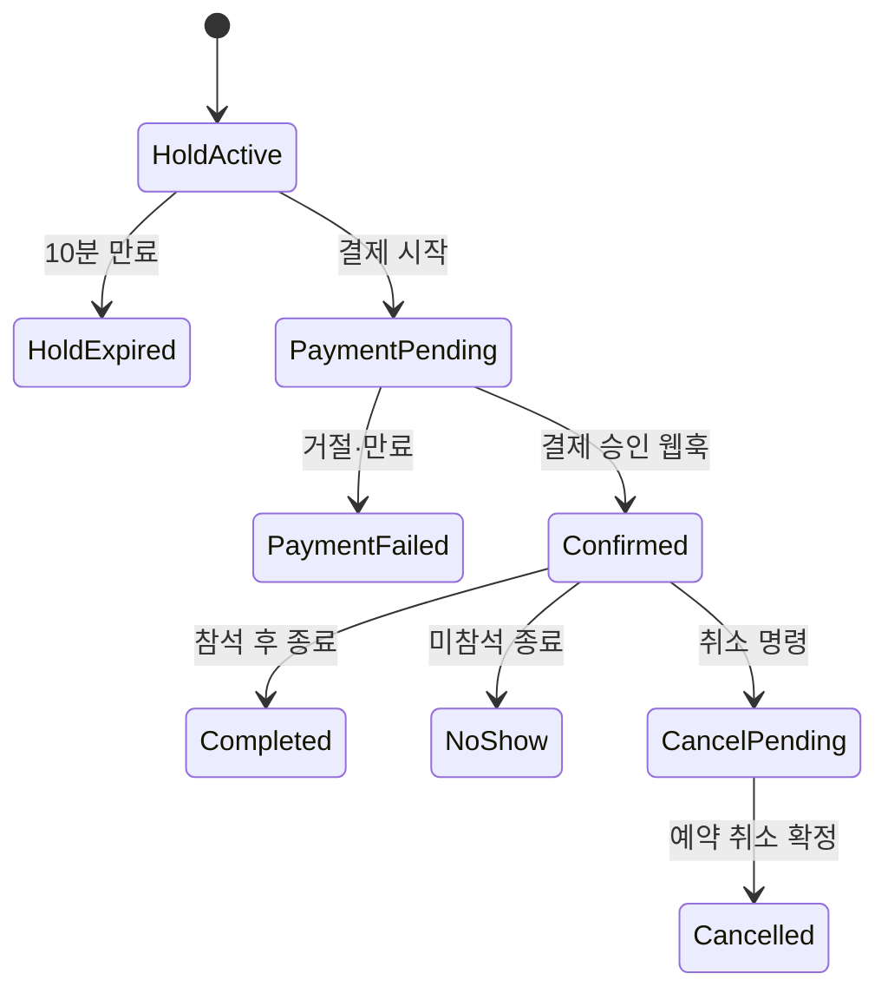

# DayLink 서비스 플로우 기획 검증

- 검증 대상: 고객 웹, 파트너센터, 운영자센터, 현장 데스크 PRD v1.0
- 검증일: 2026-08-18
- 검증 범위: 요구사항·상태·권한·예외 흐름
- 제외: 아직 구현되지 않은 코드, 실제 PG·은행·법률 적합성

## 1. 결론

기획 수준의 P0 차단 결함은 수정 후 0건이다. 네 사이트의 핵심 흐름은 시작 조건, 단일 데이터 권위자, 실패 복구, 권한, 감사 경로가 연결되어 있다.

다만 다음은 PRD로 제거할 수 없는 잔여 위험이다.

1. 완전 오프라인 현장은 마지막 동기화 이후의 긴급 취소를 알 수 없다.
2. 테스트 결제는 실제 PG의 웹훅 순서·분쟁·규제 대응을 증명하지 못한다.
3. 가상 취소 정책과 개인정보 보유 정책은 실제 출시 법률 검토를 통과한 규칙이 아니다.

따라서 이 문서의 `통과`는 구현 가능하고 논리적으로 닫힌 기획이라는 뜻이지, 실제 서비스 출시 승인을 뜻하지 않는다.

## 2. 검증 방법

각 흐름에 다음 질문을 적용했다.

- 누가 시작할 수 있는가?
- 시작 전에 어떤 상태여야 하는가?
- 가격·재고·권한을 누가 최종 판단하는가?
- 중복·지연·순서 역전 요청이 오면 결과가 같은가?
- 화면을 닫거나 네트워크가 끊기면 어디서 이어지는가?
- 실패가 다른 도메인 상태를 반쯤 바꾸지는 않는가?
- 취소·정정 시 기존 기록이 보존되는가?
- 다른 사이트에서 결과를 어떤 상태로 확인하는가?
- 개인정보와 고위험 행위가 감사 가능한가?

## 3. 반드시 지켜야 할 불변 조건

| ID | 불변 조건 |
|---|---|
| INV-01 | 확정 예약 인원 + 활성 hold 인원은 회차 정원을 초과하지 않는다. |
| INV-02 | 고객에게 청구하는 금액은 hold의 최신 가격 스냅샷과 같다. |
| INV-03 | 하나의 결제 승인으로 확정 예약이 둘 이상 생성되지 않는다. |
| INV-04 | 누적 환불액은 고객 실결제액을 초과하지 않는다. |
| INV-05 | 누적 체크인 인원은 예약 인원을 초과하지 않는다. |
| INV-06 | 기존 예약의 가격·취소 정책·게시 버전은 이후 상품 수정으로 바뀌지 않는다. |
| INV-07 | 원장 항목은 수정·삭제하지 않고 반대 방향 조정 항목으로 정정한다. |
| INV-08 | 상태 변경 권한은 화면이 아니라 Core API가 최종 판정한다. |
| INV-09 | 고위험 요청자는 같은 요청의 승인자가 될 수 없다. |
| INV-10 | 미전송 오프라인 이벤트는 새 이벤트로 재생성하지 않고 같은 clientEventId로 재시도한다. |
| INV-11 | 고객·파트너·운영자·현장 세션은 서로의 권한으로 전용되지 않는다. |
| INV-12 | 알림 실패는 이미 확정된 예약·환불을 되돌리지 않는다. |

## 4. 상태 모델 검증

### 4.1 예약·결제·환불 분리

환불은 예약 상태에 합치지 않는다. 예약은 `CANCELLED`인데 환불은 `FAILED`일 수 있으며, 이 경우 고객 웹은 `취소 완료·환불 재처리 중`처럼 두 사실을 함께 보여줄 수 있다. 이 분리로 환불 실패 때문에 취소 이력을 되돌리는 결함을 막았다.

### 4.2 상품 버전

- 파트너 초안과 심사 스냅샷, 공개본을 분리했다.
- 운영자는 심사 스냅샷 version에 대해 승인한다.
- 승인 뒤 파트너가 게시해야 고객에게 공개된다.
- 확정 예약은 자신이 구매한 게시 버전과 정책을 보관한다.
- 날짜·장소 변경은 본문 수정이 아니라 별도 일정 변경 제안이다.

판정: 통과.

### 4.3 체크인

- 참석 상태와 예약 상태를 분리했다.
- 일부 인원 참석을 `PARTIAL`로 표현한다.
- 체크인 정정은 기존 이벤트 삭제가 아니라 correction 이벤트다.
- 오프라인 결과는 서버 확인 전 잠정 상태다.

판정: 통과. 단, 긴급 취소의 오프라인 인지 한계는 잔여 위험 R-01로 남긴다.

## 5. 핵심 흐름별 검증

### 5.1 파트너 입점→상품 게시

| 단계 | 시작 조건 | 성공 결과 | 실패·복구 |
|---|---|---|---|
| 입점 입력 | 로그인, 소속 생성 | 단계별 저장 | 이탈 뒤 저장 단계부터 재개 |
| 입점 심사 | 필수 단계·파일 완료 | ACTIVE 또는 수정 요청 | 필드별 사유로 재제출 |
| 상품 작성 | ACTIVE, 편집 권한 | version이 있는 초안 | 자동 저장 충돌 비교 |
| 심사 요청 | 검증 통과 | 고정 심사 스냅샷 | 새 편집은 다음 초안으로 분리 |
| 운영자 결정 | 배정·현재 version | APPROVED/REJECTED | 409면 새 버전 재검토 |
| 게시 | APPROVED, 파트너 권한 | 검색·상세 공개 | 캐시 무효화 실패 재시도 |

검증 결과:

- 편집자가 심사 요청까지 할 수 없고 역할 분리가 유지된다.
- 승인과 게시를 분리해 운영자가 파트너 대신 판매를 시작하지 않는다.
- 캐시된 이전 본문과 실시간 판매 중지 상태가 충돌하더라도 Core API가 신규 hold를 막는다.

판정: 통과.

### 5.2 고객 검색→예약 확정

| 단계 | 최종 판단자 | 중복·경합 처리 |
|---|---|---|
| 공개 검색 | 검색 API | 품절은 표시 지연 가능, 예약 때 재검증 |
| 회차 선택 | Core API | 최신 잔여 좌석과 예상 금액 반환 |
| 로그인 | IdP/BFF | 로그인 전 hold를 만들지 않음 |
| hold·견적 | Core API 원자 처리 | 마지막 좌석은 하나의 hold만 성공 |
| 결제 제출 | 결제 sandbox + Core API | Idempotency-Key 사용 |
| 예약 확정 | 결제 웹훅 + Core API | 브라우저 성공 콜백을 최종 근거로 쓰지 않음 |
| 결과 확인 | Core API 예약 조회 | pending이면 제한 재조회, 이후 내 예약에서 복구 |

검증 결과:

- 검색 카드 가격은 참고값, 결제 직전 hold 가격은 확정값으로 구분했다.
- 로그인 시간 동안 좌석을 불필요하게 잠그지 않는다.
- 결제 반환 화면이 닫혀도 웹훅으로 확정되고 예약 목록에서 회복된다.
- 주문 하나에 한 회차만 허용해 다중 파트너 부분 실패·부분 환불 문제를 MVP에서 제거했다.

판정: 통과.

### 5.3 쿠폰·가격·정산

예시: 1인 50,000원, 2명, 플랫폼 쿠폰 10,000원.

- 상품 총액 G = 100,000원
- 고객 실결제액 C = 90,000원
- 수수료 F = floor(100,000 × 12%) = 12,000원
- 정상 파트너 예정 정산액 = 88,000원
- 플랫폼 쿠폰 비용 = 10,000원

전액 취소 시 고객에게 90,000원을 돌려주고 파트너 원장에 -88,000원 조정 항목을 쌓는다. 플랫폼 쿠폰 예약은 해제 또는 비용 반전 처리한다.

검증 결과:

- 고객 결제액과 파트너 정산 기준액이 다른 이유를 명시했다.
- 환불은 기존 원장을 고치지 않아 대사 가능하다.
- 일부 인원 취소를 MVP 고객 기능에서 제외해 쿠폰 재배분·부분 좌석 반환의 애매함을 제거했다.

판정: 통과. 운영자 예외 일부 환불의 귀책별 정산 공식은 구현 설계에서 표로 세분화해야 한다.

### 5.4 고객 취소→환불

1. 고객이 취소 예상액을 요청한다.
2. Core API가 서버 시각과 예약 정책 스냅샷으로 계산한다.
3. 고객이 확인 후 취소 명령을 보낸다.
4. 예약은 취소되고 환불 엔터티가 별도 진행된다.
5. 실패한 환불은 운영자 불일치 큐에서 같은 거래를 재처리한다.
6. 성공 시 정산 조정 항목과 알림 이벤트를 추가한다.

경계 검증:

- 브라우저 시각을 조작해도 환불 구간은 바뀌지 않는다.
- 이미 체크인했으면 일반 고객 취소를 막는다.
- 같은 취소 요청을 두 번 보내도 환불이 둘 생기지 않는다.
- 알림 실패는 환불 성공을 되돌리지 않는다.

판정: 통과.

### 5.5 예외 환불

1. CS가 정책 금액과 다른 이유·증빙을 제출한다.
2. 100,000원 초과, 체크인 후, 정책 초과 환불은 승인 대기한다.
3. 다른 승인자가 현재 기환불액을 다시 조회한다.
4. 요청 후 금액이 수정되면 기존 승인이 무효화된다.
5. 승인 시에만 Core API가 환불과 원장 조정을 수행한다.

판정: 통과. 자기 승인과 승인 직전 금액 변경을 차단했다.

### 5.6 예약 보유 회차의 일정 변경

초기안에는 대체 회차 정원 확보 시점이 없어 수락 고객을 옮기지 못할 가능성이 있었다. 다음 규칙으로 수정했다.

- 제안 생성 시 영향 인원만큼 대체 회차 정원을 별도 확보한다.
- 확보할 수 없으면 제안을 만들지 않는다.
- 응답 중에는 해당 정원을 일반 판매하지 않는다.
- 기한에 수락 고객을 원자적으로 이동하고 거절·미응답 고객을 전액 취소한다.
- 기존 예약 조건은 이동 전까지 보존한다.

판정: 수정 후 통과.

### 5.7 파트너 회차 취소

1. 파트너가 영향 예약 수와 예상 환불을 확인한다.
2. 시작 전, 권한, 재인증을 검사한다.
3. Core API가 회차 판매 중지, 예약 취소, 전액 환불 요청, 정산 조정, 알림 outbox를 생성한다.
4. 시작 후 문제는 회차 취소가 아니라 사고 사건으로 보낸다.

부분 실패 처리:

- 회차·예약 취소는 성공했지만 일부 PG 환불이 실패할 수 있다.
- 실패 환불은 재시도 대상으로 남고 예약 취소를 되돌리지 않는다.
- 고객 웹은 예약과 환불 상태를 각각 표시한다.

판정: 통과.

### 5.8 온라인 체크인

1. 장치·직원·사업장 권한을 확인한다.
2. QR 토큰을 예약으로 해석한다.
3. 취소 여부, 회차, 남은 체크인 인원을 검사한다.
4. clientEventId로 참석 이벤트를 한 번만 반영한다.
5. 응답이 유실되면 동일 ID로 결과를 재조회·재전송한다.

판정: 통과.

### 5.9 오프라인 체크인→재연결

1. 당일 최소 스냅샷과 토큰 해시를 저장한다.
2. 캐시된 유효 토큰만 잠정 체크인한다.
3. 이벤트를 IndexedDB에 같은 clientEventId로 보존한다.
4. 재연결 시 실제 health check 뒤 이벤트를 먼저 보낸다.
5. 서버가 공식 인원, 취소, 역할을 기준으로 수락·자동 병합·격리한다.
6. 이후 새 스냅샷을 받는다.

충돌 결과:

| 상황 | 서버 결과 | 화면 처리 |
|---|---|---|
| 같은 이벤트 재전송 | 기존 성공 반환 | 성공으로 종료 |
| 다른 장치의 같은 인원 | ALREADY_CHECKED_IN | 공식 인원으로 자동 교정 |
| 누적 인원 초과 | COUNT_EXCEEDED | 공식 인원 표시, 필요 시 확인 큐 |
| 취소 뒤 늦은 오프라인 이벤트 | BOOKING_CANCELLED | 참석 반영 금지, 사고 확인 |
| 다른 회차 토큰 | SESSION_MISMATCH | 자동 반영 금지 |
| 역할 회수된 actor | ACTOR_REVOKED | 격리 큐로 이동 |

판정: 조건부 통과. 마지막 동기화 이후 긴급 취소는 네트워크 없이 알 수 없어 R-01로 남는다.

### 5.10 후기→공개 집계

- 회차 종료 후 예약 상태가 `COMPLETED`이고 체크인 인원이 1명 이상인 예약만 작성 가능하다.
- 예약당 후기 하나이며 서버 unique constraint로 보장한다.
- 신고·비공개 후기는 목록과 평점 집계에서 제외한다.
- 후기 공개 상태 변경은 해당 상품 후기 캐시만 무효화한다.

판정: 통과.

### 5.11 권한 변경·세션 회수

- 고객, 파트너, 내부 운영자, 현장 장치의 인증 audience를 분리한다.
- 역할 변경은 다음 API 요청부터 적용한다.
- 파트너 전환 시 이전 조직 query cache와 초안을 제거한다.
- 현장 권한 회수 시 참석자 캐시는 제거하고 미전송 비개인 이벤트는 격리 가능한 형태로 보존한다.
- 열린 화면의 메뉴가 남아 있어도 Core API 요청은 거부한다.

판정: 통과.

## 6. 사이트 간 데이터 책임

| 데이터·행위 | 생성 UI | 최종 저장·판정 | 소비 UI |
|---|---|---|---|
| 상품 초안 | Nuxt 파트너센터 | Core API | React 심사, Next 미리보기 |
| 상품 승인 | React 운영자센터 | Core API | Nuxt 결과, Next 공개본 |
| hold·예약 | Next 고객 웹 | Core API | Next, Nuxt, React, Vue |
| 결제 웹훅 | 없음 | Core API | Next·React |
| 회차 변경 제안 | Nuxt 파트너센터 | Core API | Next 고객 웹, React 운영자 |
| 체크인 | Vue 현장 데스크 | Core API | Vue, Nuxt, React, Next 예약상태 |
| 예외 환불 승인 | React 운영자센터 | Core API | Next, Nuxt 정산 |
| 정산 조정 | React 운영자센터 | Core API 원장 | Nuxt·React |
| 후기 | Next 고객 웹 | Core API | Next, React 신고 큐 |

서로 다른 프론트가 같은 업무 상태를 자체 계산해 저장하는 구간은 없다.

## 7. 발견 결함과 조치

| ID | 심각도 | 발견 내용 | 조치 | 상태 |
|---|---|---|---|---|
| GAP-01 | 높음 | 예약과 환불 상태가 한 상태열에 섞여 환불 실패 시 예약 의미가 불명확 | hold·예약·환불 상태를 분리 | 해결 |
| GAP-02 | 높음 | 장바구니 범위가 없으면 다중 파트너 부분 실패·정산이 열림 | 주문당 한 회차로 제한 | 해결 |
| GAP-03 | 높음 | 화면 가격·좌석을 믿으면 과금 오류와 초과 예약 가능 | Core API의 원자적 견적+hold로 고정 | 해결 |
| GAP-04 | 높음 | 브라우저 결제 성공 콜백을 확정 근거로 오인 가능 | 웹훅과 예약 조회를 최종 근거로 지정 | 해결 |
| GAP-05 | 높음 | 일정 변경 수락자용 정원 확보 시점 누락 | 제안 시 대체 정원 별도 확보 | 해결 |
| GAP-06 | 중간 | 쿠폰 부담 주체와 정산 기준이 불명확 | 플랫폼 부담, G/C/F 공식 정의 | 해결 |
| GAP-07 | 중간 | 일부 인원 취소 시 좌석·쿠폰·환불 배분이 열림 | MVP 고객 기능에서 전체 취소만 지원 | 해결 |
| GAP-08 | 중간 | 같은 상품을 두 탭에서 자동 저장하면 조용히 덮어쓸 수 있음 | draftVersion과 409 비교 병합 | 해결 |
| GAP-09 | 중간 | 두 오프라인 장치가 같은 예약을 체크인 가능 | clientEventId, 서버 인원 상한, 자동 병합 | 해결 |
| GAP-10 | 중간 | 로그아웃과 미전송 큐 삭제가 충돌 | PII 캐시 삭제, 서명 이벤트 큐 잠금·인계 | 해결 |
| GAP-11 | 중간 | 상품 수정이 기존 예약 조건을 소급 변경할 수 있음 | 게시·정책·가격·회차 스냅샷 저장 | 해결 |
| GAP-12 | 중간 | 알림 실패가 본 거래를 실패시키는지 불명확 | outbox 분리, 거래 상태 유지 | 해결 |
| GAP-13 | 낮음 | 파트너 요구사항 ID가 중복됨 | 알림 설정 ID를 `PTN-CFG-001`로 수정 | 해결 |
| GAP-14 | 높음 | 긴급 취소 뒤 완전 오프라인 장치가 낡은 예약을 승인 가능 | 최대 스냅샷 나이·잠정 표시·전화 연락망 | 위험 수용 |

## 8. 잔여 위험

### R-01 오프라인 긴급 취소

- 영향: 취소 고객 또는 중지된 회차가 현장에서 잠정 입장될 수 있다.
- 완화: 시작 30분 전 동기화 시도, 2시간 초과 스냅샷 차단, 잠정 표시, 긴급 전화 연락망.
- 남는 이유: 통신이 완전히 없으면 새 서버 상태를 전달할 수 없다.
- 출시 판단: 안전 민감 체험은 오프라인 체크인을 끄는 상품 플래그가 추가되어야 한다.

### R-02 실제 결제 환경

- 영향: PG별 인증, 웹훅 서명, 지연·역전, 부분 취소, 차지백을 mock만으로 검증할 수 없다.
- 조치: 실제 출시 전 선택 PG sandbox와 계약 테스트, 웹훅 재생 테스트, 대사 배치를 별도 승인한다.

### R-03 법률·정책

- 영향: 가상 취소율과 개인정보 보유 방식이 실제 법적 의무와 다를 수 있다.
- 조치: 실제 출시 전 대한민국 전자상거래·개인정보·정산 관련 법률 검토 결과를 정책 버전으로 반영한다.

## 9. 구현 단계 필수 검증 시나리오

| 번호 | 시나리오 | 기대 결과 |
|---|---|---|
| T-01 | 마지막 1좌석에 동시 hold 100건 | 정확히 1건만 성공 |
| T-02 | 같은 결제 웹훅 10회·순서 변경 전달 | 예약 1건, 결제 원장 1건 |
| T-03 | hold 만료 직전 결제와 만료 작업 경합 | 하나의 결정된 상태와 보상 경로 |
| T-04 | 취소 요청 중 브라우저 종료 | 예약 상세에서 동일 진행 상태 복구 |
| T-05 | 환불 승인 직전 다른 부분 환불 성공 | 누적 실결제액 초과 차단 |
| T-06 | 심사 승인 직전 제출본 version 변경 | 409와 재검토 요구 |
| T-07 | 역할 회수 후 열린 탭에서 개인정보 조회 | API 거부, 화면 캐시 제거 |
| T-08 | 두 조직 전환 직후 느린 이전 응답 도착 | 이전 조직 데이터 폐기 |
| T-09 | 두 오프라인 장치가 1명 잔여 예약 처리 | 서버 1명만 반영, 다른 이벤트 병합 |
| T-10 | 취소 예약의 오프라인 이벤트 늦게 도착 | 참석 반영 금지, 격리 |
| T-11 | service worker 업데이트 중 미전송 큐 존재 | 업데이트 연기 또는 큐 보존 |
| T-12 | 상품 게시·중지 후 CDN 캐시 지연 | 신규 hold는 즉시 차단 |
| T-13 | 알림 서비스 전면 장애 | 예약·환불 성공 유지, 알림 재시도 |
| T-14 | 예약 URL·파트너 ID·운영자 경로 직접 변조 | 존재 노출 최소화, API 접근 거부 |
| T-15 | 취소 정책 경계 1초 전·후 | 서버 시각 기준 예상액 정확히 변경 |

## 10. 최종 Go/No-Go 기준

학습 프로젝트 착수: **Go**.

다음 조건 없이는 `완성된 실무형 프로젝트`로 평가하지 않는다.

- Core API mock이 불변 조건과 상태 전이를 실제로 강제한다.
- T-01~T-15가 자동 또는 재현 가능한 수동 테스트로 통과한다.
- 네 앱의 권한 우회와 개인정보 캐시 제거를 시험한다.
- 결제·환불·체크인에는 멱등 키와 감사 이벤트가 있다.
- R-01~R-03을 README와 ADR에서 숨기지 않는다.

